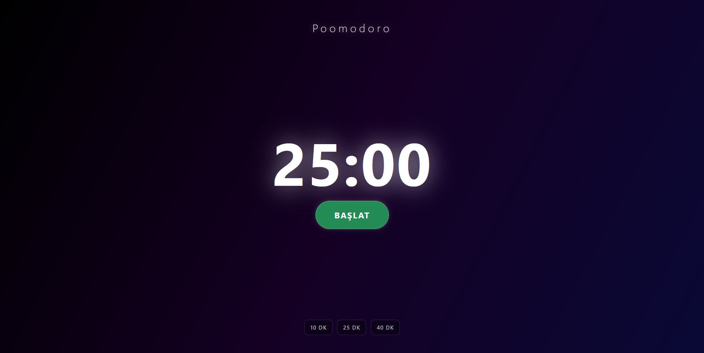
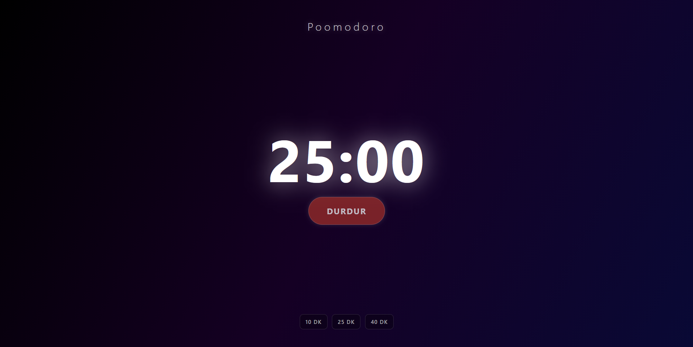
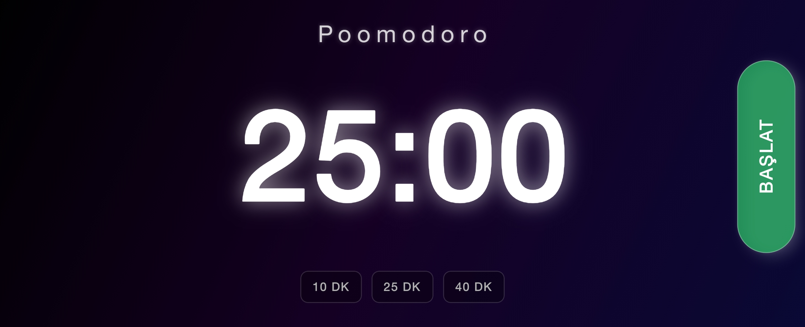
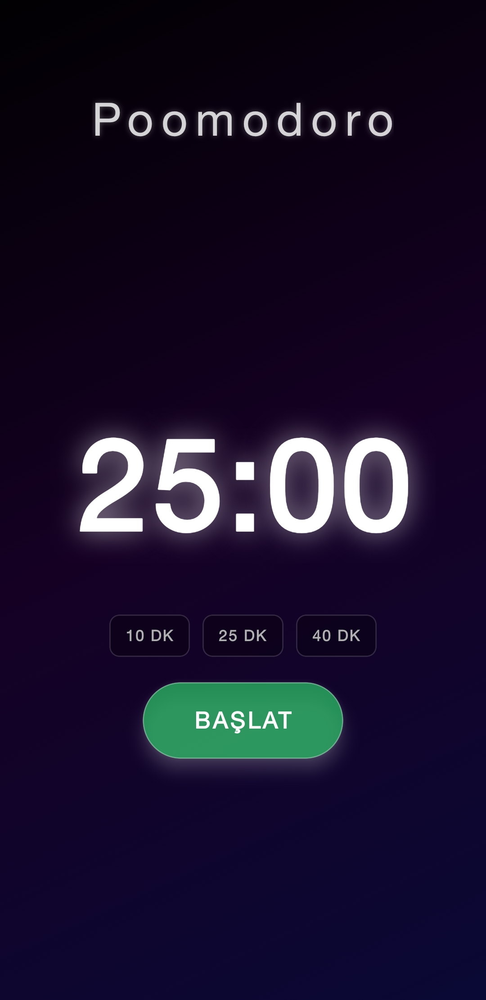

## Uzay Temalı Pomodoro Uygulaması

React Native ve Expo kullanılarak geliştirilmiş, odaklanmayı artırmak için tasarlanmış, modern ve şık bir Pomodoro zamanlayıcı uygulaması.

## Kullanılan Teknolojiler

* **React Native:** Ana framework.
* **Expo:** Geliştirme ve derleme aracı.
* **Expo Navigation Bar:** Android alt navigasyon çubuğunu gizlemek ve şeffaflaştırmak için.

## Ekran Görüntüleri

